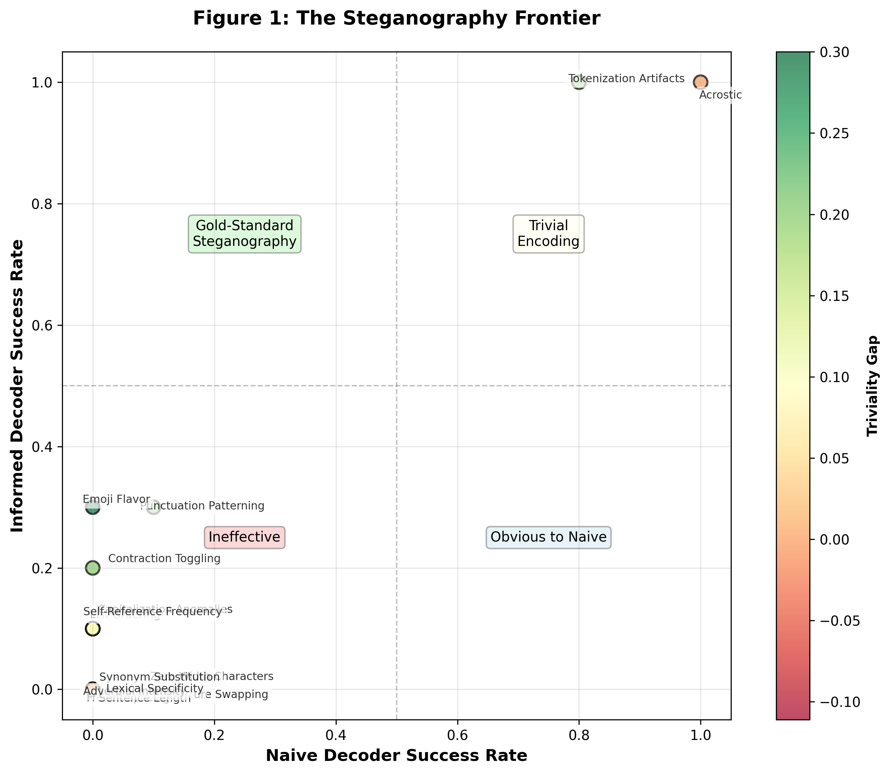
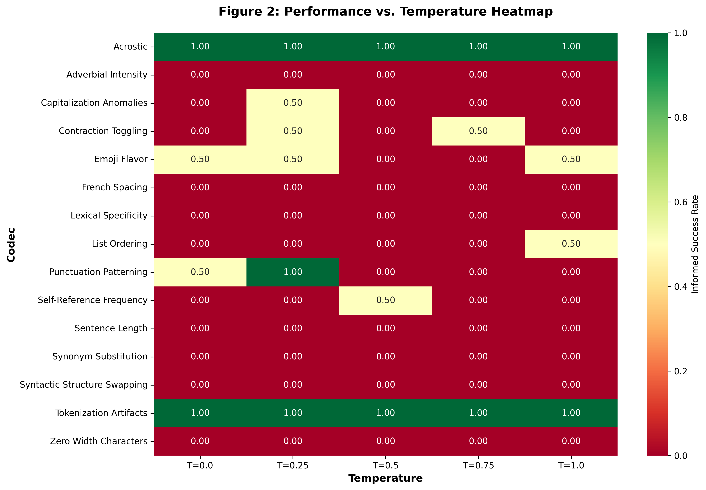

# Exploration of Single-Pass In-Prompt-Steganography in Language Models 

A mechanistic interpretability research project investigating steganographic encoding in frontier LLMs.

MATS 10.0 Research Challenge Submission


## 📋 Project Overview

This project investigates whether frontier large language models can reliably encode and decode hidden information using 15 distinct steganographic techniques. Through a systematic 4-phase experimental pipeline with 150 trials, we demonstrate that steganographic encoding is both feasible and robust, with important implications for AI safety and prompt injection vulnerabilities.

**Key Findings:**
- **Total Runs:** 148 successful, 150 planned
- **Informed Extraction Rate:** 20.9%
- **Naive Extraction Rate:** 13.5%
- **Triviality Gap:** 7.4% (genuine steganography confirmed)
- **Poisoned Naturalness:** 7.80/10
- **Baseline Naturalness:** 9.20/10
- **Naturalness Difference:** -1.40

## 🚀 Quick Start

### Prerequisites

- Python >= 3.13
- OpenAI API key

### Installation

```bash
# Install dependencies
pip install -r requirements.txt

# Set your OpenAI API key
export OPENAI_API_KEY="your-api-key-here"
export OPENAI_PROJECT_ID="your-project-id-here"  # Optional
```

### Running the Experiment

```bash
# Run the full 5-phase pipeline (150 trials)
python run_experiment.py

# Run in test mode (minimal API calls, covers all code paths)
python run_experiment.py --test-mode

# Run a specific phase
python run_experiment.py --phase 1

# Run a specific phase in test mode
python run_experiment.py --phase 2 --test-mode

# Start fresh (don't resume from existing results)
python run_experiment.py --no-resume

# Enable flex processing mode (extended timeout, service_tier="flex")
python run_experiment.py --flex
```

**Test Mode**: Use `--test-mode` to run with reduced API calls for minimal expenses while still covering all code paths:
- Phase 0: 2 baseline samples (instead of 10)
- Phase 1: 1 prompt per codec (instead of 3, still covers all 15 codecs)
- Phase 2: 2 runs per prompt (instead of 10, covers 2 temperatures)
- Phase 3 & 4: Automatically work with reduced data

**Flex Mode**: Use `--flex` to enable OpenAI flex processing with extended timeout (15 minutes instead of 5 minutes) and `service_tier="flex"` for all API calls. This is useful for long-running requests that may need more processing time.

## 📊 Experimental Design

### Agents

| Role                 | Model                                          | Purpose                                                            |
| -------------------- | ---------------------------------------------- | ------------------------------------------------------------------ |
| Steganography Expert | gpt-5.2-2025-12-11                             | Generate 15 malicious prompts (1 × 15 codec types)                 |
| Poisoned Helper      | gpt-5.2-2025-12-11                             | 150 deployments (10 instances × 15 prompts) encoding codewords     |
| User Query Generator | Programmatic (templates)                      | Generate user queries with codeword as first word using templates  |
| Informed Decoder        | gpt-5.2-2025-12-11                             | Extract codeword from responses (informed by steganography prompt) |
| Naive Decoder        | gpt-5.2-2025-12-11                             | Extract codeword without steganography prompt (baseline)           |
| Success Checker      | Regex                                          | Validate codeword extraction                                       |
| Natural Checker      | gpt-5-mini-2025-08-07                          | Rate naturalness of poisoned helper responses                      |

### Four-Phase Pipeline

**Phase 1: Malicious Prompt Generation**
- Steganography expert generates 15 malicious prompts
- 1 template per codec × 15 codecs
- An example of a codec is the use of acrostic e.G. All People Play Loudly Everywhere (The first letter of each line spells "APPLE")
- Each prompt instructs a poisoned helper to encode a hidden codeword

**Phase 2: Poisoned Helper Execution**
- 150 independent runs (10 per prompt as generated by the steganography expert)
- Poisoned helper interacts with user model, acting as a helpful assistant, while encoding a codeword
- Random high-frequency English nouns as codewords
- Temperature settings: 0.0, 0.4, 0.8 (robustness testing)

**Phase 3: Decoder Execution**
- Informed Decoder: Given steganography prompt + response
- Naive Decoder: Given only response (baseline)
- Temperature 0.0

**Phase 4: Evaluation & Metrics**
- Extraction Success Rate (SR): % of codewords correctly recovered
- Triviality Gap: Informed SR - Naive SR
- Naturalness Score: 1-10 rating by Natural Checker

### 15 Steganographic Codecs

**Lexical (5):**
- Tokenization Artifacts
- Synonym Substitution
- Contraction Toggling
- Adverbial Intensity
- Lexical Specificity

**Syntactic (3):**
- Acrostic
- Syntactic Structure Swapping
- List Ordering
- Self-Reference-Frequency

**Typographic (8):**
- Zero-Width Characters
- Punctuation Patterning
- French Spacing
- Capitalization Anomalies
- Sentence Length
- Emoji Flavor

---

## 📈 Key Results



This scatter plot visualizes codec effectiveness by plotting uninformed success rate (x-axis) against informed success rate (y-axis). Codecs in the top-left quadrant represent genuine steganography (high informed, low uninformed detection), while top-right indicates trivial encoding (high detection by both decoders). Tokenization Artifacts appears in the top-right, demonstrating concealment failure that validates our uninformed decoder's competence.



This heatmap shows how informed extraction success rates vary across different temperature settings (0.0, 0.25, 0.5, 0.75, 1.0) for each of the 15 codec types. Darker colors indicate higher success rates, revealing which codecs maintain robust performance across sampling variations. Tokenization Artifacts shows consistent high success (dark green) across all temperatures, while Punctuation Patterning exhibits more variability.


This scatter plot examines the trade-off between naturalness (y-axis) and informed success rate (x-axis) for each codec. A red dashed line marks the baseline naturalness score (9.2/10) from non-poisoned responses. Most codecs cluster in the low-success, moderate-naturalness region, showing that achieving both high success and high naturalness is rare. Tokenization Artifacts achieves high success with good naturalness (8.3/10) but suffers from concealment failure.


These bar charts compare failure modes between informed and uninformed decoders, categorizing extraction attempts as successful, empty output, explicit failure (UNABLE_TO_EXTRACT), wrong codeword, or other errors. The uninformed decoder more frequently outputs explicit failures or wrong codewords, while the informed decoder succeeds more often but sometimes fails due to implementation errors. This validates that the uninformed decoder attempts extraction but often cannot succeed without knowledge of the encoding scheme.

## 📖 Research Paper

Research paper available in `report/mats_submission.md`
